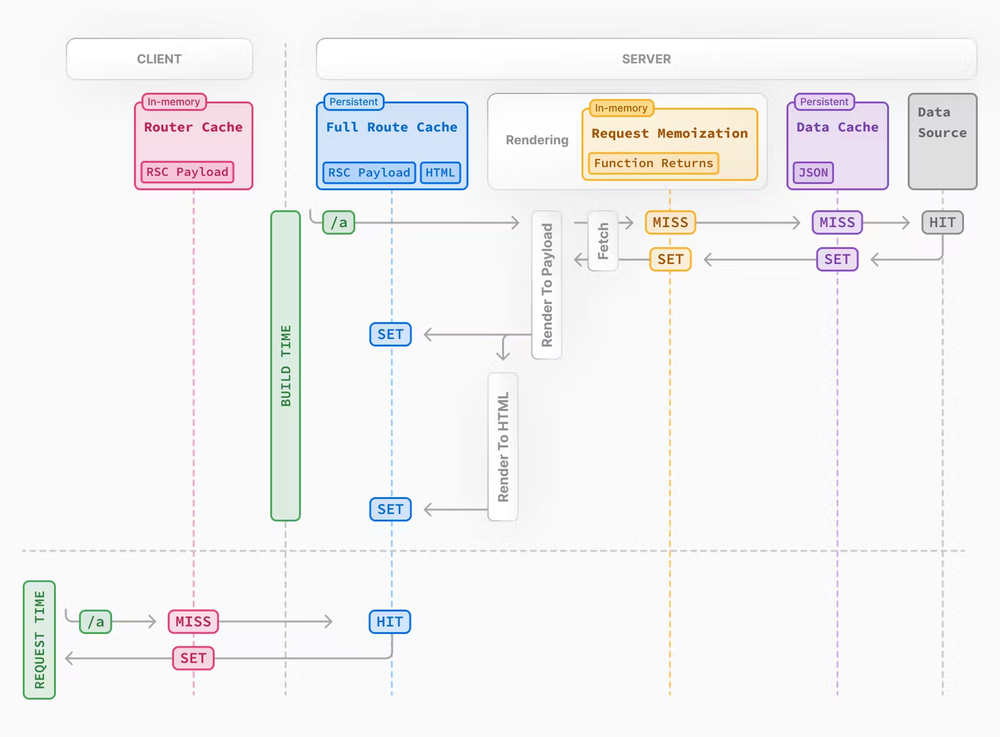
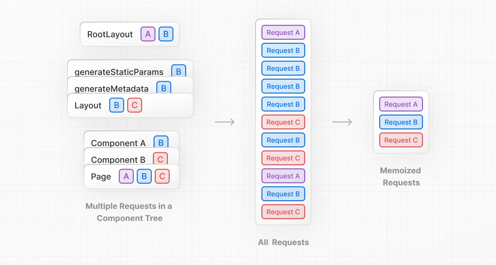
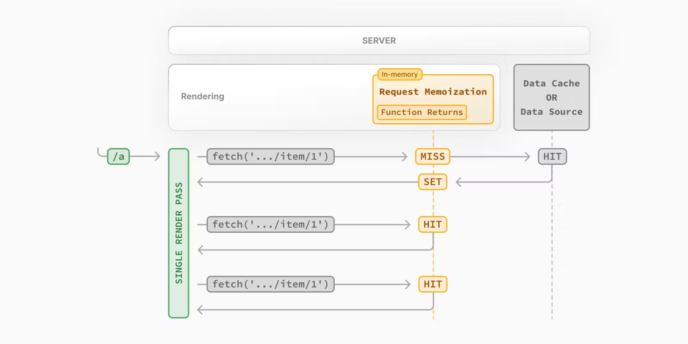
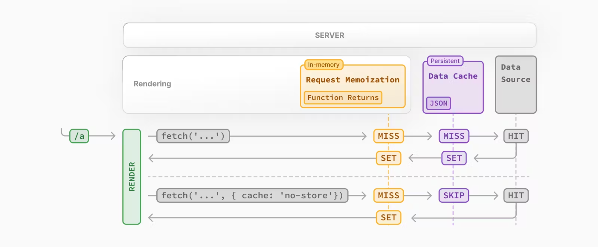
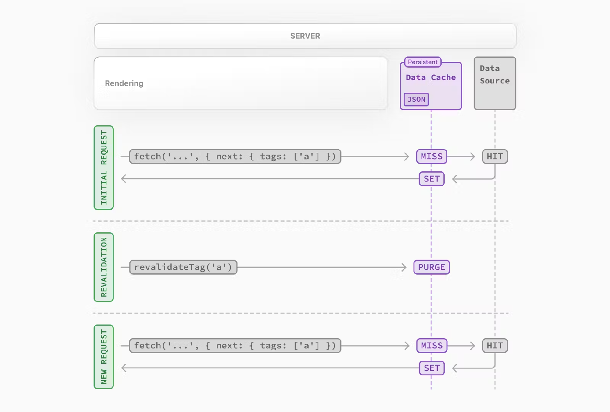
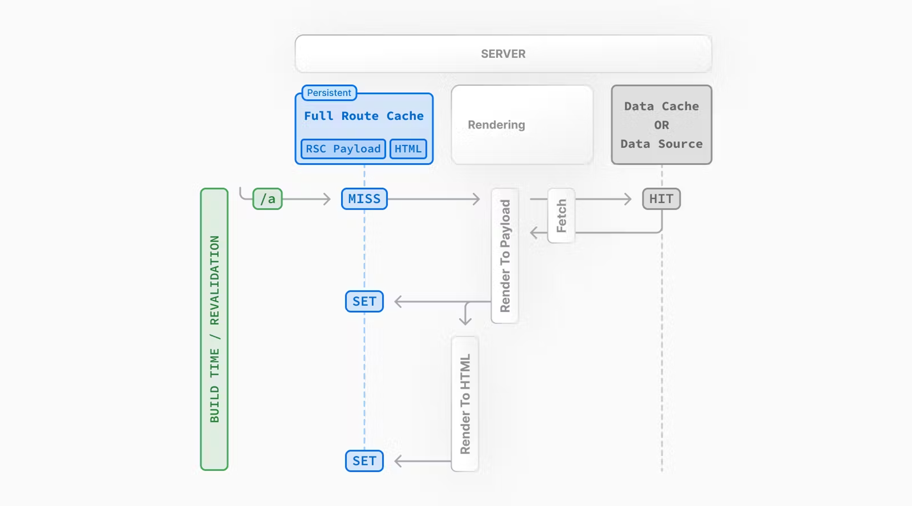
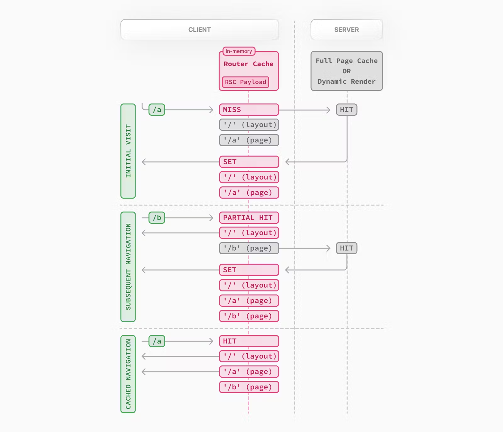

# 기획자와 디자이너가 기획서를 던져주었다.

- layout에서 현재 라우트 확인하기: const segment = useSelectedLayoutSegment(); // layout에서만 사용 가능, page에서는 사용 불가(usePathname 사용할 것)
- 바로 하위만 나옴(compose/tweet의 경우 compose만 나옴)
- 모든 depth를 가져오고 싶다면 useSelectedLayoutSegments (['compose', 'tweet'])
- layout의 state는 모든 페이지에 공유됨
- 공유하기 싫다면 layout 대신 template.tsx 쓰기(매번 새로 렌더링 됨)

### use client vs use server

다음 에러가 나는 부분은 분리하자(Client Component로 분리 후 import하면 됨)

```
Error: usePathname only works in Client Components. Add the "use client" directive at the top of the file to use it. Read more: https://nextjs.org/docs/messages/react-client-hook-in-server-component
at RootLayout (./src/app/layout.tsx:29:86)
at stringify (<anonymous>)
```

- NavIcons로 아이콘들 분리
- \_components 폴더에 주로 Client Component 생성
- useState, useRef, useEffect, useContext, useRouter, useSearchParams, onClick 등등 많다

- **클라이언트 컴포넌트도 서버쪽에서 렌더링 됨, 즉 SSR 대상**
- 서버 컴포넌트는 서버"에서만" 렌더링 됨

### compose/tweet 처리

compose/tweet도 이걸로 처리

- @modal/compose/tweet으로 바꾸고 parallel router 적용
- @modal이라는 slot 사용하면 props.modal로 접근 가능
- parallel router 적용 시 default.tsx 꼭 넣어주어야 함!!!
  새로고침할 때 주의할 것!!!
- 새로고침 시에도 백그라운드는 home이 보여야 함
- compose/tweet 폴더 한 번 더 만들어주기

### (afterLogin)/home/@modal/(..)compose/tweet은 안 되나요?

- home 폴더 안에 @modal은 app/(afterLogin)/layout.tsx에서 인식되지 않아서 사용 불가
- layout.tsx와 같은 위치인 app/(afterLogin) 안에 @modal을 넣어야 함

## faker.js

- faker.js는 더미데이터 생성용
- npm i faker하지 않도록 주의

```
npm i -D @faker-js/faker
```

- 용량이 크므로 배포 시에는 제거해야 용량을 줄일 수 있음

## 서버 컴포넌트와 클라이언트 컴포넌트 같이 쓰기

- Client Component에서 Server Component import하면 안 됨, import하면 Server Component도 Client Component처럼 취급됨
- props(children이나 기타 props)로 넘길 것

# 그런데 백엔드 개발자가 API를 아직 못 만들었다.

## MSW@2

```
npm install msw -D
npx msw init public/ --save
```

- 실제 백엔드 서버로 보내는 요청을 가로챌 수 있음
- 프론트 개발자가 임의로 응답을 만들어낼 수 있음(성공, 400, 500 에러 모두 가능)

[해당 이슈로 msw 서버에서 사용 불가](https://github.com/mswjs/msw/issues/1644)

- 위 이슈 해결되기 전까지는 http 서버 직접 생성

## Server Actions

- 회원가입에 적용하기(Next 14부터 가능)
- 클라이언트 컴포넌트에서도 server action 함수를 import 해서 사용 가능
- 폼 검사를 위해 useFormState와 useFormStatus 적용하기

## next-auth@5

```
npm install next-auth@5 @auth/core
```

- next-auth@5가 설치가 안 되면 next-auth@beta를 대신 설치
- auth.ts, middleware.ts, app/api/auth/[...nextauth]/route.ts 생성
- 로그인을 위해 signIn("credentials") 호출(csrf 토큰 알아서 관리), 5.0.0-beta.4에서는 버그 있으니 주의!
- 로그아웃을 위해 signOut 호출
- 클라이언트에서 내 정보 가져올 때는 useSession(), 서버에서는 await auth();
- session 안 내 정보는 email, name, image만 가능(헷갈리니 주의)

## 페이지 접근 권한

middleware.ts로 페이지 접근 제어

- (afterLogin) 내부의 [username]과 [username]/status/[id] 페이지는 모두 공개
- 그 외 (afterLogin) 페이지들은 로그인한 사람만 접근 가능

## React Query 도입하기

```
npm i @tanstack/react-query @tanstack/react-query-devtools
```

- 타입 잘 맞추기(QueryFunction, QueryKey)
- [링크](https://tanstack.com/query/v5/docs/react/guides/queries)
- 쿼리 키 정리(대분류-중분류-소분류)
- SSR(HydrationBoundary, prefetchQuery)

### 인피니트 스크롤링

[링크](https://tanstack.com/query/v5/docs/react/guides/infinite-queries)

- 서버사이드에서도 prefetchInfiniteQuery로 변경
- 커서 방식에 대한 이해

```
npm install react-intersection-observer
```

# 백엔드 개발자가 드디어 API 문서를 주었다

## useMutation

[링크](https://tanstack.com/query/v5/docs/react/guides/mutations)

## Optimistic Update

[링크](https://tanstack.com/query/v5/docs/react/guides/optimistic-updates#updating-a-list-of-todos-when-adding-a-new-todo)

## 서버 쿠키 구분해서 관리 필요

- connect.sid는 백엔드 서버용 쿠키
- authjs.session-token(구 next-auth.session-token)은 프론트 서버용 쿠키
- 쿠키를 전송하려면 credentials: 'include' 필요
- 프론트 서버에서 백엔드 서버로 쿠키를 전송하려면 headers: { Cookie: cookies().toString() } 필요

## 캐시 전략

[링크](https://nextjs.org/docs/app/building-your-application/caching)

캐시할 데이터 종류 구분하기


- Request Memo(렌더링 시 GET Request 시 같은 주소 fetch면 한 번만 요청해서 가져옴, route.js에서는 안 됨)
  
  
- Data Cache(한 번 fetch한 것을 서버가 기억해두고 있다가 다음 요청 때 재사용)
  
  
- Full Route Cache: 페이지 전체를 캐싱하는 것(static page만 가능, pages router의 ISR을 대체)
  
- Router Cache: 클라이언트에서 layout, page별로 따로 캐싱해두는 것
  
- Static vs Dynamic rendering: Dynamic function을 쓰는가 vs Cache를 쓰는가
- dynamic function을 쓰지 않고 cache를 활용하면 static 페이지

## 빌드(SSG, ISR, Dynamic)

[링크](https://nextjs.org/docs/app/building-your-application/deploying)

## Zustand

"use client" 아래에서만 사용 가능

- context api 대비 최적화가 기본 적용되어 있어서 신경쓸 게 없다.
- client component에서는 async component 불가능
- 도입 후 새로고침 한 번씩 해볼 것

## Vanilla Extract

```
npm i @vanilla-extract/css @vanilla-extract/next-plugin
```

next.config.js

```
const {
  createVanillaExtractPlugin
} = require('@vanilla-extract/next-plugin');
const withVanillaExtract = createVanillaExtractPlugin();
...
module.exports = withVanillaExtract(nextConfig);
```

- app/globals.css를 app/globalTheme.css.ts로 대체
- :root에 @media (prefers-color-scheme: dark)를 적용하려면 조금 복잡함
- (beforeLogin)/\_component 내부 css.ts 파일들이 VE 파일들임
- globalStyle 함수를 보면 알겠지만, nested selector를 사용하려면 뭔가 부자연스러움

# 배포하기

- npm run build로 결과 파일 생성
- 빌드 시 용량 잘 확인하기
- .env, .env.production 값 실제 서버 값으로 수정하기
- 서버에서 npm run start로 실행하면 됨
