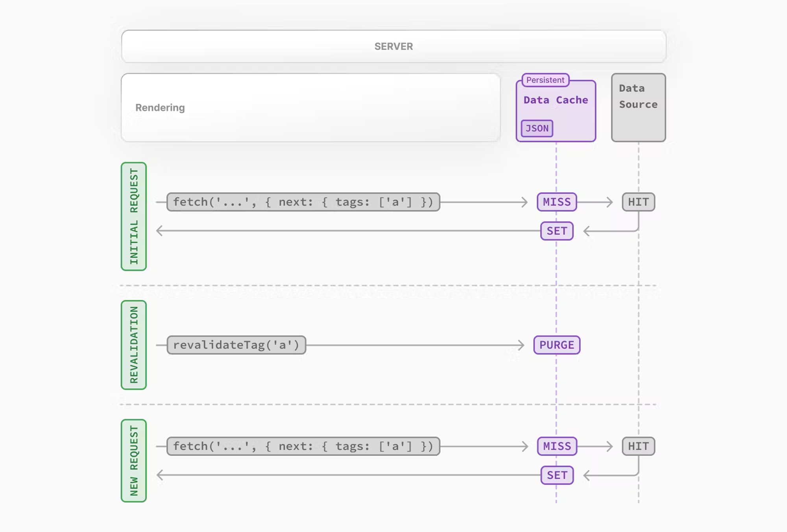
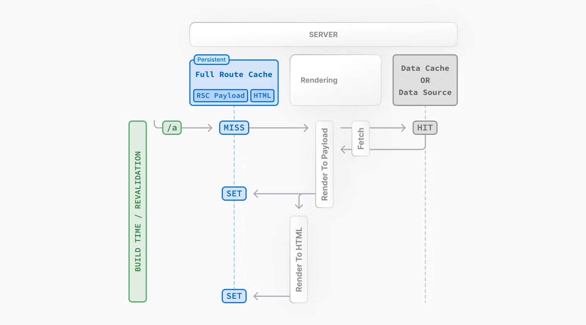

# 폴더 설명

코드를 일일이 입력하지 않고 이 폴더들에서 많이 복사해옵니다. 일일이 입력할 수가 없는게, svg 같은 태그도 있고 css도 너무 많습니다. 제가 뭔가를 복사한다고 하면 여러분들도 여기서 복사해오세요.

기존 제 다른 클론 코딩 강좌를 생각하고 **따라치기 위해 들으시면 안 됩니다**. 일례로 리액트 노드버드 강의보다 **코드량이 3배 정도 더 많아서** 따라치기보다는 복사하면서 설명하는 방식을 취했습니다.

**ch0 폴더에서부터 시작**하시는 것을 강력히 추천드립니다.

- ch0: 초기 세팅("css module을 선택한 이유" 강의가 끝났을 때의 코드 - 이 폴더를 복사해서 시작하시면 편합니다)
- ch1: 섹션1이 완료된 코드
- ch2-1: 섹션2의 "classnames로 클래스 합성하기"까지의 소스 코드
- ch2-2: 섹션2가 완료된 소스 코드
- ch3-1: 섹션3의 next-auth가 적용된 소스 코드
- ch3-2: 섹션3의 react query 인피니트 스크롤링이 적용된 소스 코드
- ch4: 배포 직전 소스 코드(포트 80으로 바꾸기 전)
- lecture: 강의 완성본 코드(버그가 좀 있습니다. 버그 해결은 아래 z-com 레포지토리에서 꾸준히 하고있어요.)
- [z-com](https://github.com/zerocho/z-com): [z.nodebird.com](https://z.nodebird.com) 배포 소스 코드(답글, 재게시, 실시간 채팅 등등이 완성되어 있어요!)

# 수강생분들의 강의노트

저보다 더 정리를 잘 해두신 분들의 노트입니다. 같이 보시면서 공부하시면 좋을 것 같습니다.
[수강생 베스트 강의노트 링크](https://zerocho.notion.site/Next-js14-7ff657dc0ec544759d0fc2e6e28da057?pvs=4)

# Next App Router

가장 크게 다른 점

- 각종 폴더 유형 추가로 디렉토리 라우팅이 편해짐
- 레이아웃 기능
- 페이지별 권한 체크
- 서버 컴포넌트 분리로 인한 최적화
- 데이터 캐시
- 서버 액션

# 클론코딩의 장단점

- 포트폴리오로 사용 금지(수강생들이 같은 걸 많이 제출해서 눈치챔)
- 뇌 빼고 따라만 하는 경우는 실력이 전혀 늘지 않음 → 스스로 해볼 것
- HTML, CSS를 개발자도구를 통해 공부할 수 있고, HTTP 요청도 네트워크 탭을 통해 분석해볼 수 있음.
- 아이디어가 안 떠오를 때 좋은 방법임. 보통은 쓰던 기능만 골라서 쓰는데 클론코딩을 하다보면 처음 보는 기능을 구현하기 위해 온갖 시도를 해보게 됨 → 공식문서를 자세하게 읽게 됨

# 프로젝트 세팅하기

**처음에 직접 세팅하기보단 ch0 폴더 내부 내용을 복사해서 시작하시면 편합니다.**

완전 처음부터 세팅하시려면 다음과 같이...

- 프로젝트 폴더를 만들고 싶은 곳으로 가서

```
npx create-next-app@latest
```

- 강의와 같게 선택하기

# 기획자와 디자이너가 기획서를 던져주었다.

## 디렉토리 구성하기

- [username]은 사용자 프로필
- i/flow/signup, i/flow/login이나 compose/tweet은 페이지 전환 없이 모달 띄워야 함
- 로그인 후에는 /home으로 redirect
- /login도 /i/flow/login으로 redirect

## page.tsx, layout.tsx, template.tsx

- 이름은 고정임(바꿀 수 없음)
- layout.tsx와 template.tsx는 공존할 수 없음
- page.tsx는 layout.tsx의 자식으로 들어감

### Routing Group

- (afterLogin), (beforeLogin) 폴더는 실제로 경로에 반영되지는 않음
- 하위 폴더들에 layout 적용 용도

### CSS Modules를 쓰는 이유

- vanilla-extract를 사용하려 했으나 Windows에서 Server Component 지원하지 않음
  [링크](https://github.com/vanilla-extract-css/vanilla-extract/issues/1086)
- WSL을 쓰면 되나 Hot reloading이 문제가 생김
- 추후 이 문제가 해결되면 vanilla-extract 도입 예정(보너스 강의에서 다룹니다!)

### layout에서 현재 라우트 확인하기

```
  const segment = useSelectedLayoutSegment();
```

- layout에서만 사용 가능, page에서는 사용 불가(usePathname 사용할 것)
- 바로 하위만 나옴(compose/tweet의 경우 compose만 나옴)
- 모든 depth를 가져오고 싶다면 useSelectedLayoutSegments (['compose', 'tweet'])
- layout의 state는 모든 페이지에 공유됨
- 공유하기 싫다면 layout 대신 template.tsx 쓰기(매번 새로 렌더링 됨)

### parallel router, intercepting routes 적용

[링크](https://nextjs.org/docs/app/building-your-application/routing/parallel-routes)

i/flow/signup과 i/flow/login은 이걸로 처리

- @ 폴더 안에 default.tsx 잊지 말기

### i/flow/signup, i/flow/login 모달 시 주의

- (beforeLogin) 내부의 @modal 안에 (.)/flow/signup을 만들어야 함
- (beforeLogin)과 동등 레벨에 만드는 경우 The default export is not a React Component in page 에러 발생
- /login에서 /i/flow/login으로 가기 위해서는 redirect로는 안 되고, router.replace를 해야 함. "use client" 사용 필요.

## 서버 컴포넌트와 클라이언트 컴포넌트 구분하기

### use client vs use server

다음 에러가 나는 부분은 분리하자(Client Component로 분리 후 import하면 됨)

```
Error: usePathname only works in Client Components. Add the "use client" directive at the top of the file to use it. Read more: https://nextjs.org/docs/messages/react-client-hook-in-server-component
at RootLayout (./src/app/layout.tsx:29:86)
at stringify (<anonymous>)
```

- NavIcons로 아이콘들 분리
- \_components 폴더에 주로 Client Component 생성
- useState, useRef, useEffect, useContext, useRouter, useSearchParams, onClick 등등 많다

- **클라이언트 컴포넌트도 서버쪽에서 렌더링 됨, 즉 SSR 대상**
- 서버 컴포넌트는 서버"에서만" 렌더링 됨

### compose/tweet 처리

compose/tweet도 이걸로 처리

- @modal/compose/tweet으로 바꾸고 parallel router 적용
- @modal이라는 slot 사용하면 props.modal로 접근 가능
- parallel router 적용 시 default.tsx 꼭 넣어주어야 함!!!
  새로고침할 때 주의할 것!!!
- 새로고침 시에도 백그라운드는 home이 보여야 함
- compose/tweet 폴더 한 번 더 만들어주기

### (afterLogin)/home/@modal/(..)compose/tweet은 안 되나요?

- home 폴더 안에 @modal은 app/(afterLogin)/layout.tsx에서 인식되지 않아서 사용 불가
- layout.tsx와 같은 위치인 app/(afterLogin) 안에 @modal을 넣어야 함

## faker.js

- faker.js는 더미데이터 생성용
- npm i faker하지 않도록 주의

```
npm i -D @faker-js/faker
```

- 용량이 크므로 배포 시에는 제거해야 용량을 줄일 수 있음

## 서버 컴포넌트와 클라이언트 컴포넌트 같이 쓰기

- Client Component에서 Server Component import하면 안 됨, import하면 Server Component도 Client Component처럼 취급됨
- props(children이나 기타 props)로 넘길 것

# 그런데 백엔드 개발자가 API를 아직 못 만들었다.

## MSW@2

```
npm install msw -D
npx msw init public/ --save
```

- 실제 백엔드 서버로 보내는 요청을 가로챌 수 있음
- 프론트 개발자가 임의로 응답을 만들어낼 수 있음(성공, 400, 500 에러 모두 가능)

[해당 이슈로 msw 서버에서 사용 불가](https://github.com/mswjs/msw/issues/1644)

- 위 이슈 해결되기 전까지는 http 서버 직접 생성

## Server Actions

- 회원가입에 적용하기(Next 14부터 가능)
- 클라이언트 컴포넌트에서도 server action 함수를 import 해서 사용 가능
- 폼 검사를 위해 useFormState와 useFormStatus 적용하기

## next-auth@5

```
npm install next-auth@5 @auth/core
```

- next-auth@5가 설치가 안 되면 next-auth@beta를 대신 설치
- auth.ts, middleware.ts, app/api/auth/[...nextauth]/route.ts 생성
- 로그인을 위해 signIn("credentials") 호출(csrf 토큰 알아서 관리), 5.0.0-beta.4에서는 버그 있으니 주의!
- 로그아웃을 위해 signOut 호출
- 클라이언트에서 내 정보 가져올 때는 useSession(), 서버에서는 await auth();
- session 안 내 정보는 email, name, image만 가능(헷갈리니 주의)

## 페이지 접근 권한

middleware.ts로 페이지 접근 제어

- (afterLogin) 내부의 [username]과 [username]/status/[id] 페이지는 모두 공개
- 그 외 (afterLogin) 페이지들은 로그인한 사람만 접근 가능

## React Query 도입하기

```
npm i @tanstack/react-query @tanstack/react-query-devtools
```

- 타입 잘 맞추기(QueryFunction, QueryKey)
- [링크](https://tanstack.com/query/v5/docs/react/guides/queries)
- 쿼리 키 정리(대분류-중분류-소분류)
- SSR(HydrationBoundary, prefetchQuery)

### 인피니트 스크롤링

[링크](https://tanstack.com/query/v5/docs/react/guides/infinite-queries)

- 서버사이드에서도 prefetchInfiniteQuery로 변경
- 커서 방식에 대한 이해

```
npm install react-intersection-observer
```

# 백엔드 개발자가 드디어 API 문서를 주었다

## useMutation

[링크](https://tanstack.com/query/v5/docs/react/guides/mutations)

## Optimistic Update

[링크](https://tanstack.com/query/v5/docs/react/guides/optimistic-updates#updating-a-list-of-todos-when-adding-a-new-todo)

## 서버 쿠키 구분해서 관리 필요

- connect.sid는 백엔드 서버용 쿠키
- authjs.session-token(구 next-auth.session-token)은 프론트 서버용 쿠키
- 쿠키를 전송하려면 credentials: 'include' 필요
- 프론트 서버에서 백엔드 서버로 쿠키를 전송하려면 headers: { Cookie: cookies().toString() } 필요

## 캐시 전략

[링크](https://nextjs.org/docs/app/building-your-application/caching)

캐시할 데이터 종류 구분하기


- Request Memo(렌더링 시 GET Request 시 같은 주소 fetch면 한 번만 요청해서 가져옴, route.js에서는 안 됨)
  
  
- Data Cache(한 번 fetch한 것을 서버가 기억해두고 있다가 다음 요청 때 재사용)
  
  
- Full Route Cache: 페이지 전체를 캐싱하는 것(static page만 가능, pages router의 ISR을 대체)
  
- Router Cache: 클라이언트에서 layout, page별로 따로 캐싱해두는 것
  
- Static vs Dynamic rendering: Dynamic function을 쓰는가 vs Cache를 쓰는가
- dynamic function을 쓰지 않고 cache를 활용하면 static 페이지

## 빌드(SSG, ISR, Dynamic)

[링크](https://nextjs.org/docs/app/building-your-application/deploying)

## Zustand

"use client" 아래에서만 사용 가능

- context api 대비 최적화가 기본 적용되어 있어서 신경쓸 게 없다.
- client component에서는 async component 불가능
- 도입 후 새로고침 한 번씩 해볼 것

## Vanilla Extract

```
npm i @vanilla-extract/css @vanilla-extract/next-plugin
```

next.config.js

```
const {
  createVanillaExtractPlugin
} = require('@vanilla-extract/next-plugin');
const withVanillaExtract = createVanillaExtractPlugin();
...
module.exports = withVanillaExtract(nextConfig);
```

- app/globals.css를 app/globalTheme.css.ts로 대체
- :root에 @media (prefers-color-scheme: dark)를 적용하려면 조금 복잡함
- (beforeLogin)/\_component 내부 css.ts 파일들이 VE 파일들임
- globalStyle 함수를 보면 알겠지만, nested selector를 사용하려면 뭔가 부자연스러움

# 배포하기

- npm run build로 결과 파일 생성
- 빌드 시 용량 잘 확인하기
- .env, .env.production 값 실제 서버 값으로 수정하기
- 서버에서 npm run start로 실행하면 됨
